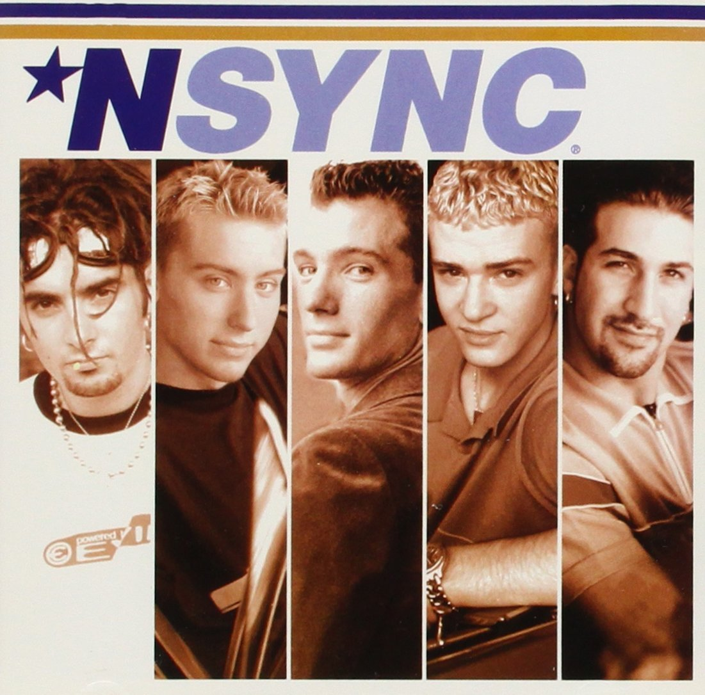

<!--
Market: SF
Adapted for: DEN
-->

<!-- Timing is tight here, too. -->


<!--1:31 WDI5 -->
<!--1:34 WDI4 -->
<!--1:30 5 minutes -->

<!-- Hook: Raise your hand if you've ever had a group essay project.  How did you share your essay?

...

One of the big problems with team projects is this exact problem.  How do you know which is the latest version?  What happens if somebody accidentally deletes everything?  What if Jack has been on fire, but he made one change that ruined our essay, and we just want to get rid of that specific change?  Welcome to version control. -->

# Git and Github

## Why is this important?
*This workshop is important because:*
- Local and cloud based version control are **fundamental** tools of **every** developer
- Git and Github are the most popular version control solution for open-source projects
- Proficient use of Git and Github allows collaboration on projects from small teams to hundreds or thousands of developers.

## What are the objectives?
*After this lesson, students will be able to:*

- **Explain** basic git commands like init, add, commit, push, pull and clone
- **Create** a git repo
- **Keep** a local git repo in sync with a remote repo on GitHub

## Where should we be now?
*Before this lesson, students should already be able to:*

- **Use** the command line
- **Use** a text editor

<!--1:34 WDI5-->
<!--Actually 1:35 -->
<!--WDI4 1:38 -->
<!--1:35 5 minutes -->

## Git vs GitHub and Version Control
Question : What is the difference between **Git** and **GitHub?**

**Git** is the tool you and your colleagues use on your local machine to keep track of the project you're all working on. You can see the history of code edits, how two peoples' code merge into the same project, and many other wonderful things. 
Check out the revision history for this project, or "repo".
**Think project manager**

**Github** is a cloud based git server and social network which uses Git under the hood for its version control system.
**Think Dropbox designed specially for Git projects.**
<!--
<details>
  <summary>What is the difference between Git and GitHub?</summary>
  <p>Git is a software version control tool that works on your local machine. It allows you to `init`, `add`, `commit`, and `fork` project 'repos'. It also has methods `push`, `pull`, and `fetch` which are designed to interact with a git server or cloud based service like GitHub.
  <br>
  Github is a cloud based git server and social network which uses Git under the hood for its version control system.
  </p>
</details>
-->


### What is version control? A closer look:

Version control is a kind of software used to track changes to files so that a comprehensive history of the file content can be reviewed.

There are two main types of version control:

- Centralized: All changes are kept on a single server
- Distributed: Changes can be tracked on individual computers, and synched using the cloud

- Git and GitHub together form a **distributed** version control system

<!--CFU: Think-pair share, difference between Git/GitHub and Centralized vs Distributed -->

<!--WDI5 1:43 -->

#### So many commands?!

There are also a lot of commands you can use in git. You can take a look at a list of the available commands by running:

```bash
$ git help -a
```

Even though there are lots of commands, in this course we will really only need about 10.

<!-- Code-along -->
<!--1:40 15 minutes -->

## Let's use Git

First, create a directory on your Desktop:

```bash
$ cd ~/Desktop
$ mkdir hello-world
```

Go into this directory.  **Hint: how do you "change directory"?**

You can place this directory under Git revision control using the command:

```bash
$ git init
```

Git will reply:

```bash
Initialized empty Git repository in <location>
```

You've now initialized the working directory.

#### The .git folder

If we look at the contents of this empty folder using:

```bash
ls -A
```

We should see that there is now a hidden folder called `.git` this is where all of the information about your repository is stored. There is no need for you to make any changes to this folder. You can control all the git flow using `git` commands.

<!--WDI5 1:48 -->

#### Add a file

Let's create a new file:

```bash
$ touch file.txt
```

If we run `git status` we should get:

```bash
On branch master

Initial commit

Untracked files:
  (use "git add <file>..." to include in what will be committed)

	file.txt

nothing added to commit but untracked files present (use "git add" to track)
```

This means that there is a new **untracked** file. Next, tell Git to take a snapshot of the contents of all files under the current directory (note the .)

```bash
$ git add -A
```
What is the difference?

This snapshot is now stored in a temporary staging area which Git calls the "index".


#### Commit

To permanently store the contents of the index in the repository, (commit these changes to the HEAD), you need to run:

```bash
$ git commit -m "Adds file.txt"
```

You should now get:

```bash
[master (root-commit) b4faebd] Adds file.txt
 1 file changed, 0 insertions(+), 0 deletions(-)
 create mode 100644 file.txt
```
<!--WDI5 1:52 -->

#### Checking the log

If we want to view the commit history, we can run:

```bash
git log
```

You should see:

```bash
* b4faebd (HEAD, master) Adds file.txt
```

If you need to exit this view, you need to press:

```bash
q
```

#### A good commit message
A good commit message is:
  - in present tense
  - describes what the commit contributes

Good | Bad
-----|----
"Adds signup and login" | "Added logout stuff"
"Creates upvote counter" | "Upvotes!"
"Fixes merge conflict" | "conflict"
"Fixes typo"| "stupid f***ing typos"
"Fixes issue #347" | [commit logs from last night](http://www.commitlogsfromlastnight.com/)

<figure>
  
  <br>
  <figcaption>Maybe just take a break.</figcaption>
</figure>

<!--2:01 WDI4 after brooke intro -->
<!--1:55 10 minutes -->
<!--Catch-up -->

#### Make changes to the file

Now let's open file.txt in Sublime:

```bash
$ subl file.txt
```

Inside the file, write something.

Running `git status` again will show you that file.txt has been **modified**.

#### Revert to a previous commit

Let's now make a second commit.

```bash
$ git add -A
$ git commit -m "Adds content to file.txt"
```

Checking `git log` will show you 2 commits with different ids:

```bash
* 6e78569 (HEAD, master) Adds content to file.txt
* b4faebd Adds file.txt
```

<!--WDI5 2:02 -->

You can return your repository back to the state of any commit using its specific commit id:

```bash
$ git checkout b4faebd
```

This changes your local repository files to the state of your first commit.

You can return to your newer commit by executing a `checkout` again:

```bash
$ git checkout 6e78569
```

It is very tempting to try to "undo" changes in a repository, and many online resources will recommend you run the command below:

```bash
$ git reset --hard b4faebd
```

This is very dangerous, because it has the ability to completely delete work. Almost definitely do **not** use this.

<!--WDI5 2:06 -->

<!--Actually 2:08 -->
<!--2:05 10 minutes -->

### GitHub

#### Making a new repository

<!--Catch-up-->

1. Go to your Github account
2. In the top left, hit the + button and select `New repository`

3. Name your repository `hello-world`

4. Click the big green Create Repository button

We now need to connect our local Git repo with our remote repository on GitHub. We have to add a "remote" repository, an address where we can send our local files to be stored.

```bash
git remote add origin git@github.com:<github-name>/hello-world.git
```

<!--2:13 when turning over to devs WDI4 (stopped at git push origin master) -->
<!--Actually 2:16 -->
<!--2:15 10 minutes -->
#### Pushing to Github

In order to send files from our local machine to our remote repository on Github, we need to use the command `git push`. However, you also need to add the name of the remote, in this case we called it `origin` and the name of the branch, in this case `master`.

```bash
git push origin master
```

After you run this command, refresh your GitHub repo page, and you should see `file.txt`!

#### Pulling from Github

Now we will add a `README.md` to our repo, a useful file that you should put in all of your repos.

Click the `Create new file` button.

Type `README.md` into the `Name your file...` box.

Enter some helpful text in the large `Edit new file` box.

Scroll down until you see the commit dialog.  The default "Create README.md" message is probably helpful enough, so you can click `Commit new file`.  Woo hoo, you committed on GitHub.

> **Note:** You should commit locally whenever possible, not on GitHub.

Now we need to `pull` our `README.md` file to our local repository.

```bash
git pull origin master
```

Once we have done this, you should see the README file on your computer. Congratulations, you are now:


<!--WDI5 2:23 -->
<!--Actually 2:24 -->
<!--WDI4 2:27 but had a lot of git issues to t-shoot, maybe next time want two teachers in the room for this section -->
<!--2:25 10 minutes -->

#### Cloning

Cloning allows you to get a local copy of a remote repository.

Navigate back to your Desktop and **rename your hello-world repository**:

```bash
cd ~/Desktop
mv hello-world hello-world-mine
```

Now ask the person sitting next to you for their github name and navigate to their repository on github:

```bash
https://www.github.com/<github-username>/hello-world
```

On the right hand side you will see:


Ensure that you have SSH checked and copy this url.

#### Clone their repo!

To retrieve the contents of their repo, all you need to do is:

```bash
$ git clone git@github.com:alexpchin/hello-world.git
```

Git should reply:

```bash
Cloning into 'hello-world'...
remote: Counting objects: 3, done.
remote: Total 3 (delta 0), reused 3 (delta 0), pack-reused 0
Receiving objects: 100% (3/3), done.
Checking connectivity... done.
```

You now have cloned your first repository!

<!--WDI5 2:29 -->
<!--Actually 2:41 -->
<!--2:35 10 minutes -->

## Forking

The `fork` & `pull` model lets anyone fork an existing repository and push changes to their personal fork without requiring access be granted to the source repository.

Most commonly, forks are used to either propose changes to someone else's project or to use someone else's project as a starting point for your own idea.

#### Cloning vs Forking

When you fork a repository, you make a new **remote** repository that is exactly the same as the original, except you are the owner. You can then `clone` your new fork and `push` and `pull` to it without needing any special permissions.

When you clone a repository, unless you have been added as a contributor, you will not be able to push your changes to the original remote repository.

<!--THIS IS A GREAT OPPORTUNITY TO PRACTICE IRL--have devs fork and clone tonight's HW repository -->
<!--WDI5 2:37 turning over to devs, coming back 2:41 -->

#### Pull requests

When you want to propose a change to a repository (the original project) that you have forked, you can issue a pull request. This basically is you saying:

_"I've made some changes to your repository, if you want to include them in your original one then you can pull them from my fork!"_

<!--2:43 to 2:46 WDI5 -->
<!--2:48 WDI4 -->
<!--Actually 2:51 -->
<!--2:45 5 minutes -->

## Questions

Use what you've learned today to answer the following questions with a partner:

* How do I send changes to the staging area?
* How do I check what is going to be committed?
* How do I send the commits to Github?

## Licensing
All content is licensed under a CC­BY­NC­SA 4.0 license.
All software code is licensed under GNU GPLv3. For commercial use or alternative licensing, please contact legal@ga.co.
